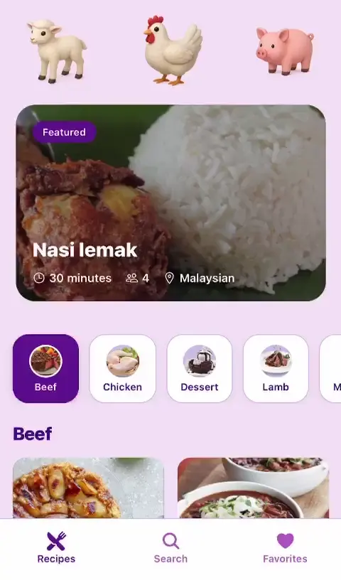
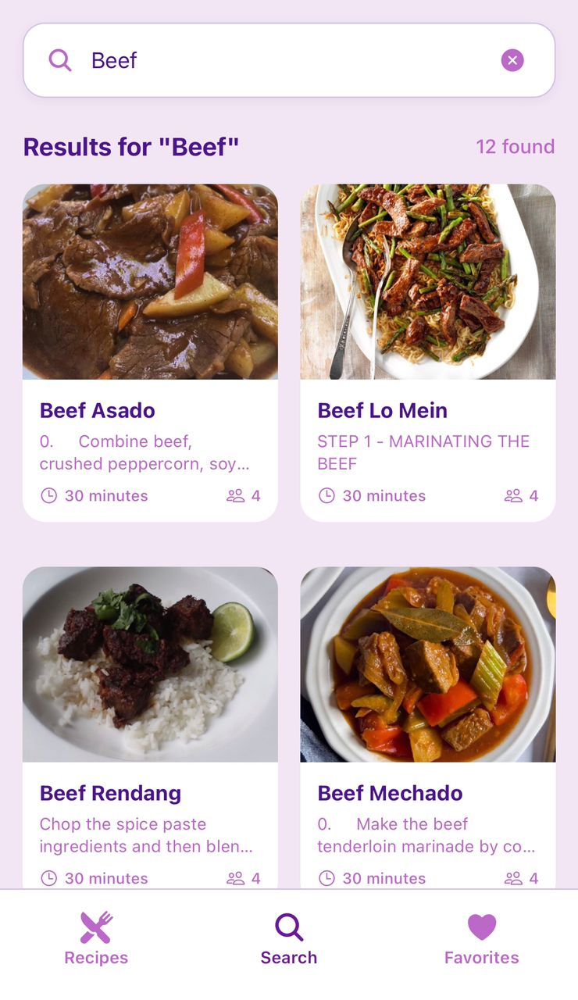

# 🍳 Recipe App - Mobile Frontend

<div align="center">  

  [](https://expo.dev)
  [](https://reactnative.dev)
  [](https://reactjs.org)
  [](https://www.typescriptlang.org/)
  
  **A beautiful, intuitive recipe discovery app built with React Native and Expo**
  
  *Discover thousands of recipes, save your favorites, and cook with confidence*
  
</div>

---

## 📱 Some Screenshots

<div align="center" style="display: flex; flex-wrap: wrap; justify-content: center; justify-content: space-between; padding-inline: 10px;">
  
  <div>

   ### Home Screen
  

  </div>
  
  <div>

  ### Recipe Details Screen
  

  </div>

  <div>
  
  ### Search Screen
  

  </div>
  
</div>

---

## ✨ Features

### 🏠 **Home & Discovery**
- **Featured Recipes**: Discover daily featured recipes curated just for you
- **Category Browse**: Explore recipes by categories (Chicken, Beef, Pork, Lamb, etc.)
- **Visual Categories**: Beautiful category cards with appetizing images
- **Pull-to-Refresh**: Stay updated with fresh content

### 🔍 **Smart Search**
- **Real-time Search**: Find recipes instantly with debounced search
- **Intelligent Results**: Search by name, ingredient, or cuisine type
- **Visual Grid**: Browse search results in an elegant grid layout
- **No Results Handling**: Graceful fallback to random recipes

### ❤️ **Favorites Management**
- **Save Recipes**: Bookmark recipes for quick access
- **Persistent Storage**: Favorites saved securely with Expo Secure Store
- **Beautiful Empty State**: Encouraging UI when no favorites exist
- **Quick Access**: Dedicated favorites tab for easy browsing

### 🔐 **Authentication**
- **Secure Login**: Powered by Clerk authentication
- **Email Verification**: Robust verification system
- **User Registration**: Seamless onboarding experience
- **Password Security**: Show/hide password functionality

### 📖 **Recipe Details**
- **Complete Instructions**: Step-by-step cooking instructions
- **Ingredient Lists**: Organized ingredients with measurements
- **Cooking Time**: Preparation and cooking duration
- **Serving Size**: Number of servings information
- **High-Quality Images**: Stunning recipe photography

---

## 🛠 Tech Stack

### **Core Technologies**
- **[React Native](https://reactnative.dev)** `0.79.6` - Cross-platform mobile framework
- **[Expo](https://expo.dev)** `~53.0.22` - Development platform and toolchain
- **[React](https://reactjs.org)** `19.0.0` - UI library
- **[TypeScript](https://www.typescriptlang.org/)** `~5.8.3` - Type safety

### **Navigation & Routing**
- **[Expo Router](https://docs.expo.dev/router/introduction/)** `~5.1.5` - File-based routing
- **[React Navigation](https://reactnavigation.org)** `^7.1.6` - Navigation library
- **[Bottom Tabs](https://reactnavigation.org/docs/bottom-tab-navigator/)** `^7.3.10` - Tab navigation

### **Authentication**
- **[Clerk](https://clerk.com)** `^2.14.27` - Complete authentication solution
- **[Expo Secure Store](https://docs.expo.dev/versions/latest/sdk/securestore/)** - Secure local storage

### **UI & Animation**
- **[Expo Image](https://docs.expo.dev/versions/latest/sdk/image/)** - Optimized image component
- **[Expo Linear Gradient](https://docs.expo.dev/versions/latest/sdk/linear-gradient/)** - Beautiful gradients
- **[Expo Vector Icons](https://docs.expo.dev/guides/icons/)** - Icon library
- **[React Native Reanimated](https://docs.swmansion.com/react-native-reanimated/)** - Smooth animations
- **[Expo Blur](https://docs.expo.dev/versions/latest/sdk/blur/)** - Blur effects

### **External APIs**
- **[TheMealDB API](https://www.themealdb.com/api.php)** - Recipe data source

---

## 🚀 Getting Started

### Prerequisites
- Node.js (v16 or higher)
- npm or yarn
- [Expo CLI](https://docs.expo.dev/get-started/installation/)
- iOS Simulator (for iOS development)
- Android Studio/Emulator (for Android development)

### Installation

1. **Clone the repository**
   ```bash
   git clone <repository-url>
   cd Recipe-App/mobile
   ```

2. **Install dependencies**
   ```bash
   npm install
   # or
   yarn install
   ```

3. **Set up environment variables**
   ```bash
   # Configure Clerk authentication keys in your Expo project
   # Add your API keys to the Expo configuration
   ```

4. **Start the development server**
   ```bash
   npx expo start
   ```

### 📱 Running on Devices

#### **Development Build**
```bash
npx expo start --dev-client
```

#### **iOS Simulator**
```bash
npx expo start --ios
```

#### **Android Emulator**
```bash
npx expo start --android
```

#### **Web Browser**
```bash
npx expo start --web
```

---

## 🔧 Available Scripts

| Script | Description |
|--------|-------------|
| `npm start` | Start the Expo development server |
| `npm run android` | Open on Android emulator |
| `npm run ios` | Open on iOS simulator |
| `npm run web` | Open in web browser |
| `npm run lint` | Run ESLint for code quality |
| `npm run reset-project` | Reset to clean project state |

---

## 🤝 Contributing

We welcome contributions! Please follow these steps:

1. **Fork the repository**
2. **Create a feature branch**: `git checkout -b feature/amazing-feature`
3. **Commit your changes**: `git commit -m 'Add amazing feature'`
4. **Push to branch**: `git push origin feature/amazing-feature`
5. **Open a Pull Request**

### **Code Style**
- Follow ESLint configuration
- Use TypeScript for type safety
- Follow React Native best practices
- Write descriptive commit messages

---

## 📄 License

This project is licensed under the MIT License - see the [LICENSE](LICENSE) file for details.

---

## 👥 Team

Built with ❤️ by the Recipe App team

---

## 🆘 Support

- **Documentation**: [Expo Docs](https://docs.expo.dev/)
- **Community**: [Expo Discord](https://chat.expo.dev)
- **Issues**: Create an issue in this repository

---

<div align="center">
  
  **Happy Cooking! 👨‍🍳👩‍🍳**
  
  *Made with React Native & Expo*
  
</div>
